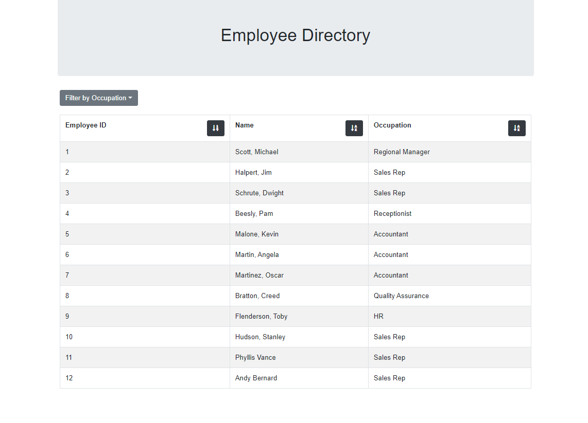
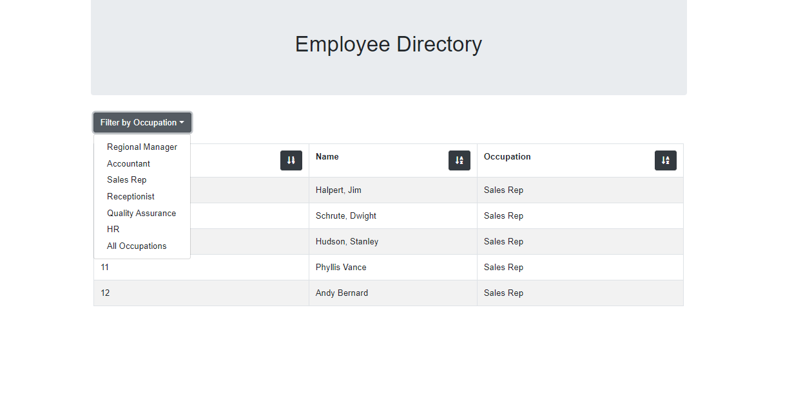

# Employee Directory

This application was created soon after I was introduced to React. It contains an employee directory in which the user can filter the presented employees by occupation and sort in descending order according to id, name or occupation. 

The technologies used to create this application include: 
* React.js
* Bootstrap
* HTML/CSS

The application has been deployed on Heroku: https://infinite-journey-61856.herokuapp.com/

## Preview: 

